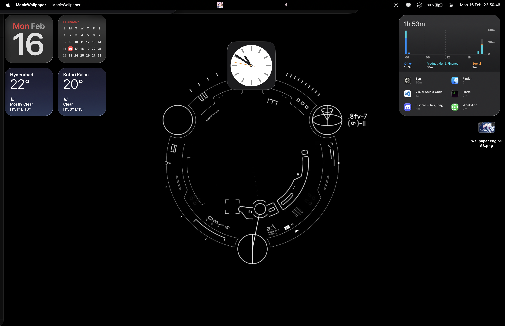

# Macie-Plugin-for-Wallpaper-Engine

> **Note**: This is a personal project built for my own use. Contributions, suggestions, and improvements from others are always appreciated!

A lightweight macOS desktop application that plays Wallpaper Engine videos as desktop wallpapers using native macOS frameworks. Features a modern dark-themed gallery interface for browsing and managing wallpapers.

## Project Overview

This application plays Wallpaper Engine video wallpapers directly on your macOS desktop, behind your desktop icons. Browse and select from your Wallpaper Engine library using an intuitive gallery interface with thumbnail previews, sidebar navigation, and performance optimizations.

## Screenshots




## Architecture

### Technology Stack

- **Build System**: CMake 3.20+
- **Core Engine**: C++17 (`Macie::AssetManager`, exposed through a C++ API implemented in Objective-C++)
- **macOS Bridge**: Objective-C++
- **UI Layer**: Objective-C + AppKit (NSWindow, NSCollectionView)
- **Video Playback**: AVFoundation (hardware-accelerated)
- **Rendering**: AVPlayerLayer + QuartzCore
- **Image Decoding**: ImageIO (thread-safe thumbnail generation)
- **Frameworks**: Cocoa, AVFoundation, CoreMedia, Metal, QuartzCore, IOKit, ServiceManagement, ImageIO, UniformTypeIdentifiers

## Current Features

### Implemented
- **Desktop Wallpaper Video Playback**: Seamless video looping behind desktop icons
- **Thumbnail Caching**: Memory + disk cache for fast loading (`~/Library/Caches/MacieWallpaper/thumbnails/`)
- **Metadata Caching**: Real resolution, duration, and file size read once per wallpaper and persisted (`~/Library/Caches/MacieWallpaper/metadata.plist`)
- **Performance Monitor**: Auto-pause on battery power or fullscreen apps (configurable)
- **Sleep/Wake Handling**: Playback pauses on sleep and is re-evaluated on wake
- **Async Thumbnail Generation**: Non-blocking extraction via ImageIO, falling back to AVAssetImageGenerator for videos without a preview image
- **Video Selection**: Click any thumbnail to instantly switch wallpapers
- **Hero Preview Panel**: Muted looping preview of the active wallpaper with its real metadata
- **Favorites**: Per-wallpaper heart toggle, persisted in NSUserDefaults
- **Recents**: The last 20 played wallpapers, in most-recent-first order
- **Search**: Live title filtering, scoped to the active sidebar section
- **Audio Controls**: State-aware mute/unmute toggle (muted by default)
- **Keyboard Shortcuts**: Next `Cmd+]`, Previous `Cmd+[`, Random `Cmd+R`, Toggle Mute `Shift+Cmd+M`, Settings `Cmd+,`, Change Location `Cmd+L`, Gallery `Cmd+0`
- **Wallpaper Engine Integration**: Automatic scanning of Steam Workshop directory
- **Welcome Window**: First-launch setup wizard for steamapps selection
- **Settings Sheet**: Path, performance, launch-at-login, and cache options, opened from the sidebar, the toolbar, or `Cmd+,`
- **Configurable Steam Path**: Folder picker to select steamapps location (saved in preferences)
- **Window Management**: Positioned at `kCGDesktopWindowLevel - 1` for proper layering
- **Mouse Passthrough**: Desktop icons remain fully clickable
- **Display Change Handling**: The desktop window is re-framed when the screen resolution or arrangement changes
- **Universal Binary**: Supports both Apple Silicon (ARM64) and Intel (x86_64)

### Video Playback Features
- AVFoundation-based renderer with hardware acceleration
- AVPlayerLooper for seamless, gap-free looping
- Efficient buffering (2 second forward buffer)
- Existence check before loading, plus KVO on the item's status to catch load failures
- Whatever AVFoundation can decode: MP4 and MOV in practice. Wallpapers in container
  formats AVFoundation does not support (`.mkv`, for example) are listed but will not play.

### Performance Characteristics
- **CPU Usage**: ~2-5% during playback (hardware accelerated)
- **Memory**: ~150-200MB (including video buffers)
- **Startup Time**: <2 seconds (including workshop scan)
- **Video Switching**: Instant (<100ms)
- **Thumbnail Generation**: Async, non-blocking

## Technical Implementation

### 1. Desktop Window Management
- Borderless NSWindow positioned at `kCGDesktopWindowLevel - 1`
- Window level: -2147483624 (behind desktop icons, above desktop picture)
- Collection behavior: Stationary, all spaces, ignore cycle
- Mouse events: Passthrough enabled (`ignoresMouseEvents = YES`)
- Screen parameter monitoring for display changes

### 2. Video Rendering
- AVQueuePlayer with AVPlayerLooper for seamless looping
- AVPlayerLayer added to window's content view
- Video gravity: `AVLayerVideoGravityResizeAspectFill`
- Default state: Muted (volume = 0.0)
- Status monitoring via KVO on player item

### 3. Asset Management
- First launch shows welcome window to select steamapps directory
- Selected path saved to NSUserDefaults for persistence
- Validates folder contains `/workshop/content/431960/`
- Menu item to change location anytime (Cmd+L)
- `project.json` parsed with NSJSONSerialization behind a C++ interface (`Macie::AssetManager`)
- Filters for video-type wallpapers only
- Validates file existence before adding to collection
- Extracts: id, title, type, video file path, preview image, description, tags

### 4. Thumbnail Caching
- Dual-layer cache: NSCache (memory) + disk storage (PNG files)
- Cache location: `~/Library/Caches/MacieWallpaper/thumbnails/`
- Memory cache limit: 100 items
- Async generation on a GCD global queue
- Decoding and encoding go through ImageIO, which is safe off the main thread (unlike `NSImage lockFocus`)
- Uses the preview image declared in `project.json`, falls back to common preview filenames, then to a video frame

### 5. Video Metadata
- Resolution and duration read from the asset's video track (`loadTracksWithMediaType:`), with `preferredTransform` applied so rotated videos report the right dimensions
- File size read from the filesystem
- Results persisted to `~/Library/Caches/MacieWallpaper/metadata.plist`, invalidated when the video's size changes
- Concurrent requests for the same wallpaper are coalesced into a single read; completions are delivered on the main queue

### 6. Performance Monitor
- Power source monitoring via IOPSNotificationCreateRunLoopSource
- Fullscreen app detection via CGWindowListCopyWindowInfo
- Configurable pause-on-battery option
- Configurable pause-on-fullscreen option
- Sleep/wake observed on the NSWorkspace notification center
- Delegate pattern for playback control notifications

### 7. Gallery UI
- Dark-themed interface with sidebar navigation (Library, Favorites, Recent, Random, collections, Settings, About)
- Hero panel with a looping preview and the active wallpaper's real resolution, duration, and file size
- NSCollectionView with flow layout
- Wallpaper cards with hover animations (CATransform3D scale)
- Selection highlighting with blue border and glow
- Item size: 195x160 with 12px rounded corners
- Grid spacing: 16pt between items
- Every playback entry point (card click, Random, Next/Prev, shuffle) routes through one apply path, so persistence, recents, and the hero panel cannot diverge
- Resizable window (minimum 1100x720, default 1280x800)

## Project Structure

```
Macie-Plugin-for-Wallpaper-Engine/
├── CMakeLists.txt              # Build configuration
├── include/                    # Header files
│   ├── AppDelegate.h
│   ├── AssetManager.hpp        # C++ asset management interface
│   ├── MacieAssetManagerWrapper.h  # Obj-C++ bridge wrapper for AssetManager
│   ├── AVVideoRenderer.h
│   ├── Constants.h             # App constants and defaults (extern declarations)
│   ├── MainWindowController.h
│   ├── PerformanceMonitor.h    # Battery/fullscreen detection
│   ├── ThumbnailCache.h        # Thumbnail caching system
│   ├── VideoCollectionItem.h
│   ├── WallpaperMetadataCache.h # Resolution/duration/size cache
│   └── WelcomeWindowController.h
├── src/
│   ├── main.m                  # Application entry point
│   ├── AppDelegate.mm          # App lifecycle, menu bar, sleep/wake
│   ├── core/
│   │   ├── Constants.m         # Single definition point for the constants
│   │   ├── AssetManager.mm     # Workshop scanning, NSJSONSerialization parsing
│   │   ├── MacieAssetManagerWrapper.mm  # Obj-C++ wrapper (owns AssetManager)
│   │   ├── PerformanceMonitor.mm # Power source & fullscreen monitoring
│   │   ├── ThumbnailCache.mm   # Memory + disk thumbnail cache (ImageIO)
│   │   └── WallpaperMetadataCache.mm # Video metadata, persisted to a plist
│   ├── renderers/
│   │   └── AVVideoRenderer.mm  # Video playback & looping
│   └── ui/                     # User interface
│       ├── MainWindowController.mm  # Gallery window, sidebar, settings sheet
│       ├── VideoCollectionItem.m    # Grid item with hover effects
│       └── WelcomeWindowController.m # First-launch wizard
├── resources/
│   └── AppIcon.icns            # Bundled app icon
└── build/                      # CMake build output
    └── MacieWallpaper.app
```

## Project Completion Checklist

### Phase 1: Core Foundation (COMPLETED)
- [x] CMake build system configuration
- [x] C++ core engine structure (`Macie::AssetManager` + Obj-C++ wrapper)
- [x] Objective-C++ bridge layer
- [x] Desktop window creation and positioning
- [x] Window level management (behind desktop icons)
- [x] Mouse passthrough for desktop icons
- [x] Universal binary support (ARM64 + x86_64)

### Phase 2: Video Playback (COMPLETED)
- [x] AVFoundation video renderer implementation
- [x] AVPlayerLooper for seamless looping
- [x] Video file validation
- [x] Hardware-accelerated playback
- [x] Volume and mute controls
- [x] Playback state management

### Phase 3: Wallpaper Engine Integration (COMPLETED)
- [x] Workshop directory scanning
- [x] project.json parsing (NSJSONSerialization)
- [x] Video metadata extraction (title, type, file path, preview, description, tags)
- [x] File existence validation
- [x] Type filtering (video wallpapers only)

### Phase 4: Gallery UI (COMPLETED)
- [x] Main window controller with NSCollectionView
- [x] Collection view flow layout
- [x] Video collection item UI components
- [x] Async thumbnail generation from videos
- [x] Thumbnail display in grid
- [x] Video selection handling
- [x] Mute/unmute button in toolbar
- [x] Video count display
- [x] Window resizing support

### Phase 5: Polish & Enhancement (COMPLETED)
- [x] README documentation
- [x] Configurable Steam path (via folder picker)
- [x] Path saved in NSUserDefaults preferences
- [x] Menu bar with "Change Wallpaper Location"
- [x] State-aware mute button (checks before toggling)
- [x] Persistent thumbnail cache (memory + disk)
- [x] Dark-themed UI with sidebar navigation
- [x] Welcome window for first-launch setup
- [x] Settings sheet hosted by the gallery window
- [x] Hover animations on wallpaper cards
- [x] Performance monitor (battery/fullscreen detection)
- [x] Launch at login option (toggle in Settings, uses SMAppService on macOS 13+)
- [x] Additional keyboard shortcuts (next/previous/random/mute, plus a standard Edit menu)
- [x] Real per-wallpaper metadata (resolution, duration, file size) with a persistent cache

### Phase 6: Advanced Features
- [x] Favorites and collections system
- [x] Search and filter in gallery (title search, scoped to the active section)
- [x] Sleep/wake event handling
- [ ] Multi-monitor support (different wallpapers per screen)
- [ ] Playlist mode with auto-rotation
- [ ] Time-based wallpaper switching
- [ ] Custom video import (drag and drop)
- [ ] Scene wallpaper support (3D/interactive)
- [ ] Performance profiles (quality presets)
- [ ] Video playback speed control
- [ ] Custom video filters/effects


## Future Enhancements

Additional features under consideration:
- Preview panel with larger video playback
- iCloud settings sync
- Multi-monitor support with per-display wallpapers
- Playlist mode with scheduling
- Filtering by resolution, duration, and tags (tags are already parsed, just not surfaced)

## Requirements

- **macOS**: 12.0+ (Monterey or later)
- **CMake**: 3.20 or higher
- **Xcode Command Line Tools**: For C/C++/Objective-C compilation
- **Wallpaper Engine**: Videos in Steam Workshop directory
- **Apple Developer Account**: Optional (for code signing)

### System Requirements
- **Architecture**: Apple Silicon (ARM64) or Intel (x86_64)
- **RAM**: 4GB minimum, 8GB recommended
- **Storage**: 100MB for app, plus space for Wallpaper Engine videos
- **Display**: Any resolution (tested on Retina displays, MBA(m4))

## Building from Source

```bash
# Clone repository
git clone https://github.com/ItsMePheniX/Macie-Plugin-for-Wallpaper-Engine.git
cd Macie-Plugin-for-Wallpaper-Engine

# Configure with CMake
cmake -S . -B build -G "Unix Makefiles"

# Build
cmake --build build

# Run
open build/MacieWallpaper.app
```

### VS Code Tasks

`.vscode/` is gitignored, so a fresh clone has no tasks defined. If you add your own
`tasks.json`, these are the four that map to the workflow above:

```bash
# Configure build
Cmd+Shift+P -> "Tasks: Run Task" -> "CMake: Configure"

# Build project (default: Cmd+Shift+B)
Cmd+Shift+P -> "Tasks: Run Build Task" -> "CMake: Build"

# Run application
Cmd+Shift+P -> "Tasks: Run Task" -> "Run App"

# Clean build
Cmd+Shift+P -> "Tasks: Run Task" -> "CMake: Clean"
```

## Usage

1. **First Launch**: Welcome window guides you to select your steamapps folder
   - Usually located at: `/Users/[username]/Library/Application Support/Steam/steamapps`
   - Or: `/Users/[username]/steamapps` (if you've moved Steam)
   - Must contain: `workshop/content/431960/` (Wallpaper Engine workshop)

2. **Automatic Scan**: App scans your Wallpaper Engine videos; thumbnails and metadata are generated lazily as cards appear
3. **Gallery Opens**: Browse thumbnails in a dark-themed gallery with sidebar
4. **Select Wallpaper**: Click any thumbnail to set as wallpaper
5. **Browse**: Use the sidebar for Library, Favorites, Recent, Random, and keyword collections, or the search field to filter by title
6. **Audio Control**: Use the speaker button in the toolbar, or `Shift+Cmd+M`
7. **Settings**: Click "Settings" in the sidebar, the gear in the toolbar, or press `Cmd+,`:
   - Change Steam folder location
   - Enable/disable pause on battery
   - Enable/disable pause when apps are fullscreen
   - Launch at login
   - Clear thumbnail cache
8. **Quit**: Press `Cmd+Q` or choose Quit from menu

Closing the gallery leaves the wallpaper playing; click the Dock icon to bring the gallery back.

## Known Limitations

- **Single Monitor**: The wallpaper is drawn on the main screen only
- **Video Types Only**: Only supports video wallpapers (no scenes or web types)
- **Keyword Collections**: Sidebar collections are keyword-matched against wallpaper titles, not user-defined
- **No Playlist Mode**: Manual wallpaper selection required

## Troubleshooting

### No Videos Found
- Verify Wallpaper Engine is installed via Steam
- Check path: `/Users/[username]/steamapps/workshop/content/431960/`
- Ensure you have subscribed to video wallpapers in Workshop

### Window Not Behind Icons
- Check Console.app for window level messages
- Try restarting the application
- System may reset window level on display changes

### Video Not Playing
- Check the container format — AVFoundation handles MP4 and MOV; `.mkv` and other
  unsupported containers appear in the gallery but fail to load
- Verify file exists and is not corrupted
- Check Console.app for AVFoundation errors

### Build Errors
```bash
# Clean and rebuild
rm -rf build
cmake -S . -B build
cmake --build build
```

## Code Quality

- Builds clean with `-Wall -Wextra` (only `-Wno-unused-parameter`, since AppKit delegate and target/action methods must declare parameters they don't use)
- CamelCase naming conventions enforced
- ARC (Automatic Reference Counting) enabled
- Deprecated APIs avoided where a replacement exists at the 12.0 deployment target; `AVAssetImageGenerator` is the one exception, where the macOS 13+ async API is used behind an `@available` check and the older synchronous call is kept as the fallback
- Off-main-thread work (thumbnails, metadata) uses ImageIO and AVFoundation rather than AppKit drawing

## Design Decisions

### Why CMake over Xcode?
- **Cross-platform build system**: Works with any IDE
- **Command-line friendly**: Easy CI/CD integration
- **VS Code integration**: Full development without Xcode
- **Flexibility**: Easy to modify build configuration

### Why Objective-C++ over Swift?
- **Direct C++ integration**: No bridging overhead
- **Memory control**: More granular management
- **Mature tooling**: Well-established patterns
- **Performance**: No Swift runtime overhead

### Why AVFoundation?
- **Native framework**: No external dependencies
- **Hardware acceleration**: VideoToolbox integration
- **Codec support**: Every format the system can already decode
- **Efficiency**: Minimal CPU and battery impact

### Why NSJSONSerialization?
- **Correctness**: Handles escapes, nesting, and unicode that a hand-rolled key scanner gets wrong
- **No dependencies**: Ships with the platform, so nothing is vendored
- **Still C++ at the seam**: `Macie::AssetManager` keeps its C++ interface; only the implementation is Objective-C++


## Contributing

Contributions are welcome! Please feel free to submit pull requests or open issues for bugs and feature requests.

### Development Setup
1. Fork the repository
2. Clone your fork
3. Create a feature branch
4. Make your changes
5. Test thoroughly
6. Submit a pull request


## License

See LICENSE file for details.